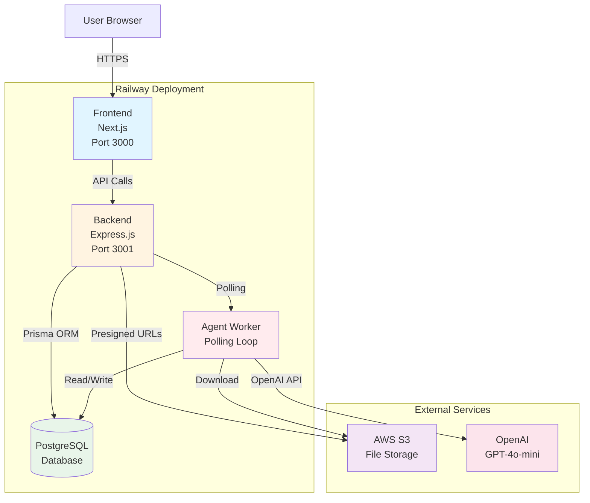
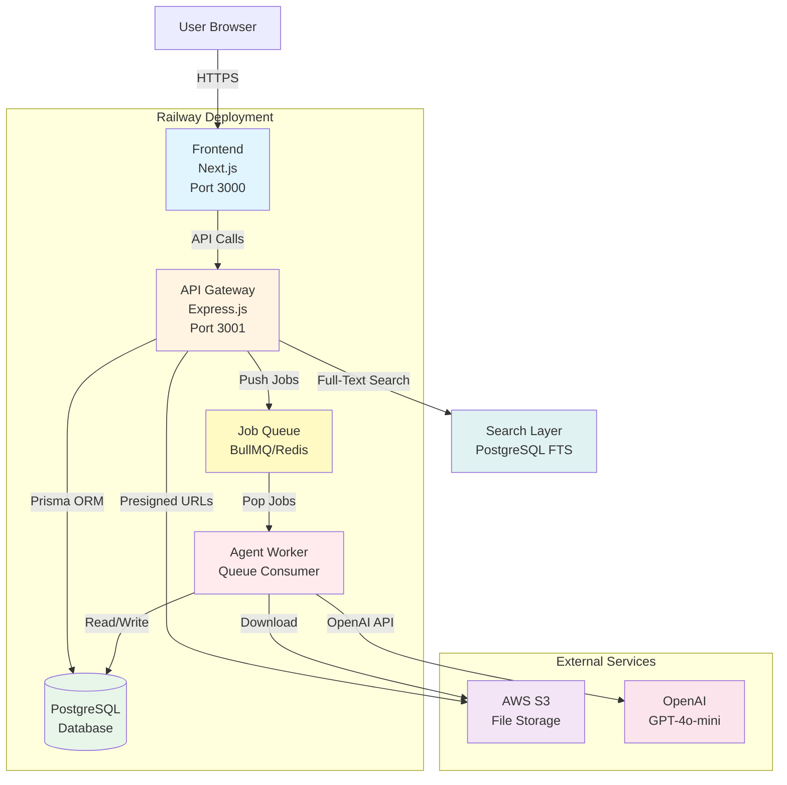

# Project Rogue - Architecture Analysis
**Date:** December 31, 2025
**Status:** AS-IS vs TO-BE Gap Analysis

---

## Executive Summary (10 Bullets)

1. **Current State:** 3-service architecture (Frontend, Backend, Agent Worker) deployed on Railway with PostgreSQL database
2. **Frontend:** Next.js 16 with React 19, client-side rendering, proxies API calls to backend
3. **Backend:** Express.js with Prisma ORM, handles all business logic and database operations
4. **Agent Worker:** Simple polling worker (5-second intervals) processes document reviews asynchronously
5. **Database:** PostgreSQL with 15+ models including Investment, Document, ReviewJob, AuditLog, Flags
6. **Storage:** AWS S3 with presigned URLs (optional - falls back to local storage)
7. **Deployment Issues:** Backend returning 500 errors, database connection problems, migration failures
8. **Core Flow Working:** Create investment → Upload documents → Agent review → Store results (locally)
9. **Missing:** Proper queue system, idempotent agent runs, structured fact extraction, search layer
10. **Next Steps:** Fix deployment stability, add proper job queue, implement idempotency, add search

---

## A) AS-IS Architecture

### Repo Structure Map

```
rogue-portfolio-core/
├── app-web/                    # Next.js Frontend
│   ├── src/
│   │   ├── app/
│   │   │   ├── api/           # API routes (proxy to backend)
│   │   │   │   ├── health/
│   │   │   │   ├── documents/
│   │   │   │   ├── investments/
│   │   │   │   ├── portfolio/
│   │   │   │   └── review/
│   │   │   ├── investments/   # Investment pages
│   │   │   ├── simple-mvp/    # Standalone MVP page
│   │   │   └── start/         # Redirect page
│   │   └── components/        # React components
│   ├── .railway/
│   │   └── build.sh
│   ├── package.json
│   └── railway.json
│
├── backend/                    # Express.js Backend
│   ├── src/
│   │   ├── api/               # API route handlers
│   │   │   ├── documents/
│   │   │   └── review/
│   │   ├── lib/               # Core libraries
│   │   │   ├── prisma.ts
│   │   │   ├── storage.ts     # S3 integration
│   │   │   ├── openai.ts
│   │   │   └── auditLogger.ts
│   │   ├── middleware/        # Express middleware
│   │   │   ├── auth.ts
│   │   │   ├── changeRationale.ts
│   │   │   └── errorHandler.ts
│   │   └── index.ts           # Express app entry
│   ├── prisma/
│   │   ├── schema.prisma      # Database schema
│   │   └── migrations/        # Database migrations
│   ├── .railway/
│   │   ├── build.sh
│   │   └── start.sh
│   ├── package.json
│   └── railway.json
│
├── agent-worker/               # Background Agent Worker
│   ├── src/
│   │   ├── lib/
│   │   │   ├── agent.ts       # Review job processor
│   │   │   ├── prisma.ts
│   │   │   └── storage.ts
│   │   └── index.ts           # Worker entry (polling loop)
│   ├── prisma/
│   │   └── schema.prisma
│   ├── .railway/
│   │   └── start.sh
│   ├── package.json
│   └── railway.json
│
└── Docs/                       # Project documentation
```

### Frontend Details

**Framework:** Next.js 16.1.1 with React 19.2.3
**Rendering Mode:** Client-Side Rendering (CSR) - 'use client' on all pages
**Key Pages/Routes:**
- `/` - Main portfolio dashboard (calls `/api/portfolio`)
- `/investments/create` - Create new investment form
- `/investments/[id]` - View investment details
- `/simple-mvp` - Standalone MVP page (works without backend)
- `/start` - Auto-redirect to simple-mvp

**API Calls:**
- All API routes in `src/app/api/` proxy to backend
- Uses `NEXT_PUBLIC_BACKEND_URL` env var (defaults to `http://localhost:3001`)
- Example: `/api/portfolio` → `${BACKEND_URL}/api/portfolio`

**Environment Variables:**
- `NEXT_PUBLIC_BACKEND_URL` - Backend API URL
- `PORT` - Server port (Railway provides)

### Backend Details

**Framework:** Express.js 4.18.2 with TypeScript
**Port:** 3001 (or `PORT` env var)
**Endpoints:**
- `GET /health` - Health check
- `GET /api/portfolio` - Get all investments with metrics
- `GET /api/investments` - List investments
- `GET /api/investments/:id` - Get investment details
- `POST /api/investments` - Create investment (with auth)
- `POST /api/investments/create` - Create investment (no auth)
- `PUT /api/investments/:id` - Update investment (with auth)
- `POST /api/documents/presigned-url` - Get S3 upload URL
- `POST /api/documents/upload-complete` - Complete upload
- `POST /api/review/start` - Start agent review
- `GET /api/review/:id` - Get review job status
- `POST /api/review/:id` - Retry review job
- `POST /api/review/analyze` - Analyze documents
- `POST /api/review/analyze-direct` - Direct analysis
- `GET /api/actions` - List actions
- `GET /api/actions/:id` - Get action details
- `PUT /api/actions/:id` - Update action
- `POST /api/actions/:id/clear` - Clear action
- `POST /api/valuations` - Create valuation

**Auth:** Basic middleware
- `authenticate` - Checks for user in request
- `requireChangeRationale` - Requires rationale for changes

**File Upload Handling:**
- Generates presigned S3 URLs for direct upload
- Stores metadata in Document table
- Calculates SHA-256 checksums

**Background Jobs:**
- No queue system - uses polling in agent-worker
- Agent worker polls ReviewJob table every 5 seconds
- Processes jobs with status 'QUEUED' and retryCount < 3

### Database Details

**DB:** PostgreSQL (Railway managed)
**ORM:** Prisma 6.19.1
**Key Models:**
- `Investment` - Main investment record
- `Document` - Uploaded documents with checksums
- `ReviewJob` - Agent review jobs with status tracking
- `AuditLog` - Change history
- `Flag` - Risk flags (revenue miss, burn spike, etc.)
- `ActionRequired` - Investor actions
- `Founder` - Founder information
- `Forecast` - Revenue/burn forecasts
- `FounderUpdate` - Quarterly updates
- `Cashflow` - Investment cashflows
- `Valuation` - Valuation history
- `Note` - Investment notes

**Key Relations:**
- Investment → Documents (one-to-many)
- Investment → ReviewJobs (one-to-many)
- Investment → Flags (one-to-many)
- Investment → AuditLogs (one-to-many)

**Migrations:**
- `prisma migrate deploy` - Run migrations on deploy
- Stored in `backend/prisma/migrations/`

### Storage Details

**Current:** AWS S3 (optional)
- Presigned URLs for upload/download
- Falls back to local storage if not configured
- Files stored in `public/uploads/documents/` locally

**Environment Variables:**
- `AWS_ACCESS_KEY_ID` - AWS access key
- `AWS_SECRET_ACCESS_KEY` - AWS secret key
- `S3_BUCKET_NAME` - S3 bucket name
- `AWS_REGION` - AWS region (default: us-east-1)
- `S3_ENDPOINT` - Custom S3 endpoint (optional)

### Deployment Details

**Railway Services:**
1. **app-web** - Next.js frontend
   - Build: `bash .railway/build.sh`
   - Start: `npm run start` (Next.js server)
   - Healthcheck: `/api/health`
   - Port: 3000 (or $PORT)

2. **backend** - Express backend
   - Build: `bash .railway/build.sh`
   - Start: `bash .railway/start.sh` (runs migrations + starts server)
   - Healthcheck: `/health`
   - Port: 3001 (or $PORT)

3. **agent-worker** - Background worker
   - Build: `npx prisma generate && npm run build`
   - Start: `bash .railway/start.sh`
   - No healthcheck
   - Runs continuously

**Environment Variables Required:**

**Frontend:**
- `NEXT_PUBLIC_BACKEND_URL` - Backend URL

**Backend:**
- `DATABASE_URL` - PostgreSQL connection (Railway provides)
- `OPENAI_API_KEY` - OpenAI API key
- `AWS_ACCESS_KEY_ID` - AWS access key (optional)
- `AWS_SECRET_ACCESS_KEY` - AWS secret key (optional)
- `S3_BUCKET_NAME` - S3 bucket name (optional)

**Agent Worker:**
- `DATABASE_URL` - PostgreSQL connection
- `AWS_ACCESS_KEY_ID` - AWS access key (optional)
- `AWS_SECRET_ACCESS_KEY` - AWS secret key (optional)
- `S3_BUCKET_NAME` - S3 bucket name (optional)

### Known Issues

**From Logs & Status Docs:**

1. **Backend 500 Errors**
   - `/api/portfolio` returning 500 errors
   - Likely cause: Database connection issue or migration failure

2. **Database Connection Issues**
   - DATABASE_URL may not be set correctly
   - Migrations may have failed

3. **Migration Failures**
   - Railway migrations not running properly
   - May need to recreate database

4. **Frontend Client-Side Exceptions**
   - Browser errors when backend fails
   - No graceful degradation

5. **Healthcheck Issues**
   - Frontend healthcheck passes (simple endpoint)
   - Backend healthcheck may fail if DB not connected

6. **Agent Worker Issues**
   - Polling approach is inefficient
   - No proper queue system
   - May miss jobs if polling fails

**Likely Cause Categories:**
- **Build vs Runtime:** Build succeeds, runtime fails (DB connection)
- **CORS:** Not an issue (CORS set to allow all origins)
- **Env Var Mismatch:** DATABASE_URL not propagating correctly
- **Browser-Only Errors:** Frontend shows errors when backend fails

---

## B) AS-IS Visual Diagram



**Data Flow:**
1. User fills investment form in Frontend
2. Frontend requests presigned URL from Backend
3. Backend generates S3 presigned URL
4. Frontend uploads file directly to S3
5. Frontend calls Backend to complete upload (stores metadata in DB)
6. Frontend starts review job (creates ReviewJob in DB)
7. Agent Worker polls DB for QUEUED jobs
8. Agent Worker downloads files from S3
9. Agent Worker processes with OpenAI
10. Agent Worker updates ReviewJob status in DB
11. Frontend polls Backend for job status
12. Frontend displays results

---

## C) TO-BE Architecture (Target)

### Architecture Diagram



### Key Improvements

**1. Clear Boundaries:**
- Frontend never talks directly to DB (already enforced)
- Upload flow: Presigned URL (already implemented, keep)
- Agent runs are idempotent (NEW - add document hash + prompt version check)

**2. Background Processing:**
- Replace polling with proper queue (BullMQ + Redis)
- Jobs are pushed to queue, not polled from DB
- Worker consumes jobs from queue
- Better error handling and retry logic

**3. Database Schema Enhancements:**

**New Tables:**
```prisma
model ExtractedFact {
  id              String      @id @default(uuid())
  investmentId    String
  investment      Investment  @relation(fields: [investmentId], references: [id], onDelete: Cascade)
  documentId      String
  document        Document    @relation(fields: [documentId], references: [id], onDelete: Cascade)
  factType        String      // e.g., "founder_name", "revenue", "burn_rate"
  factValue       String
  confidence      Float       // 0-1
  sourcePage      Int?
  sourceQuote     String?
  extractedAt     DateTime    @default(now())
  reviewJobId     String
  reviewJob       ReviewJob   @relation(fields: [reviewJobId], references: [id], onDelete: Cascade)

  @@index([investmentId])
  @@index([documentId])
  @@index([factType])
}

model ReviewJob {
  // ... existing fields ...
  promptVersion   String      @default("1.0")  // NEW: for idempotency
  extractedFacts  ExtractedFact[]              // NEW: relation
}
```

**4. Idempotent Agent Runs:**
- Check if ReviewJob exists with same `docChecksums` + `promptVersion`
- If exists and SUCCEEDED, return existing job
- If exists and FAILED, allow retry (increment retryCount)
- Prevent duplicate fact extraction

**5. Search/Recall Layer:**

**Phase 1: Postgres Full-Text Search (Immediate)**
```prisma
model Investment {
  // ... existing fields ...
  @@index([companyName])
  @@index([sector])
  @@index([stage])
}

model ExtractedFact {
  // ... existing fields ...
  @@index([factType])
  @@index([factValue])  // For text search
}
```

**Phase 2: Vector DB (Optional, Future)**
- Use pgvector extension in PostgreSQL
- Store embeddings for documents
- Semantic search across documents
- Requires additional infrastructure

**6. Audit Trail:**
- Every extracted fact links to source (doc_id + page/quote)
- AuditLog already tracks all changes
- ReviewJob tracks processing history

**7. API Layer:**
- Keep Express.js as API gateway
- Add rate limiting
- Add request validation
- Add proper error handling

---

## D) Gap Analysis + Plan

### Gap Table

| Gap | Impact | Effort | Fix | Owner | Sequence |
|-----|--------|--------|-----|-------|----------|
| **Backend 500 errors** | Critical | Low | Fix DB connection, recreate database, verify migrations | Dev | 1 |
| **Healthcheck failing** | High | Low | Ensure DB connected before healthcheck passes | Dev | 1 |
| **No proper job queue** | High | Medium | Add BullMQ + Redis, replace polling | Dev | 2 |
| **Agent not idempotent** | Medium | Medium | Add promptVersion, check duplicates before processing | Dev | 2 |
| **No structured fact extraction** | High | High | Create ExtractedFact model, update agent to extract facts | Dev | 3 |
| **No search layer** | Medium | Medium | Add Postgres full-text search indexes | Dev | 3 |
| **No source tracking** | Medium | Low | Store page/quote with each extracted fact | Dev | 3 |
| **Frontend error handling** | Medium | Low | Add graceful degradation, better error messages | Dev | 2 |
| **Missing env var validation** | High | Low | Validate all required env vars on startup | Dev | 1 |
| **No retry logic for agent** | Medium | Low | Add exponential backoff, max retries | Dev | 2 |

### Sequenced Plan (MVP-First)

**Phase 1: Stabilize Deployment (Days 1-2)**
1. Fix database connection issues
2. Recreate Railway PostgreSQL database
3. Verify migrations run successfully
4. Add env var validation on startup
5. Fix healthcheck to verify DB connection
6. Test all API endpoints

**Phase 2: Core User Flow (Days 3-4)**
1. Add graceful error handling in frontend
2. Test create investment → upload → review → view flow
3. Fix any remaining bugs in core flow
4. Add loading states and progress indicators
5. Test with real documents

**Phase 3: Background Processing (Days 5-6)**
1. Add BullMQ + Redis to Railway
2. Replace polling with queue-based processing
3. Add proper retry logic with exponential backoff
4. Add job timeout handling
5. Monitor queue performance

**Phase 4: Idempotency & Facts (Days 7-8)**
1. Add ExtractedFact model to schema
2. Add promptVersion to ReviewJob
3. Implement idempotency check (docChecksums + promptVersion)
4. Update agent to extract structured facts
5. Store source (page/quote) with each fact
6. Test duplicate prevention

**Phase 5: Search & Recall (Days 9-10)**
1. Add Postgres full-text search indexes
2. Create search API endpoints
3. Add search UI to frontend
4. Test search functionality
5. (Optional) Evaluate pgvector for semantic search

---

## E) Next 7 Days Action List

### Day 1: Deployment Stabilization
- [ ] Recreate Railway PostgreSQL database
- [ ] Verify DATABASE_URL is set correctly
- [ ] Run migrations manually to ensure they work
- [ ] Add env var validation to backend startup
- [ ] Fix healthcheck to verify DB connection
- [ ] Test backend healthcheck endpoint

### Day 2: API Testing
- [ ] Test all backend API endpoints
- [ ] Fix any 500 errors
- [ ] Test frontend-backend communication
- [ ] Verify CORS is working
- [ ] Test document upload flow
- [ ] Test review job creation

### Day 3: Frontend Error Handling
- [ ] Add graceful degradation when backend fails
- [ ] Add better error messages to UI
- [ ] Add loading states for async operations
- [ ] Add retry logic for failed API calls
- [ ] Test error scenarios

### Day 4: End-to-End Testing
- [ ] Test complete flow: create → upload → review → view
- [ ] Test with multiple documents
- [ ] Test with large files
- [ ] Test concurrent users
- [ ] Fix any bugs found

### Day 5: Queue Setup
- [ ] Add Redis to Railway
- [ ] Install BullMQ packages
- [ ] Create queue configuration
- [ ] Update backend to push jobs to queue
- [ ] Update agent worker to consume from queue

### Day 6: Queue Testing
- [ ] Test job queuing
- [ ] Test job processing
- [ ] Test retry logic
- [ ] Test error handling
- [ ] Monitor queue performance

### Day 7: Idempotency Implementation
- [ ] Add ExtractedFact model to schema
- [ ] Add promptVersion to ReviewJob
- [ ] Implement idempotency check
- [ ] Update agent to extract facts
- [ ] Test duplicate prevention

---

## Questions (If Blocked)

1. **S3 Configuration:** Is AWS S3 currently configured in Railway? If not, should we use Railway's volume storage instead?
   - *Confirm by checking Railway env vars for AWS_ACCESS_KEY_ID*

2. **OpenAI API Key:** Is the OpenAI API key valid and working?
   - *Confirm by checking backend logs for OpenAI API errors*

3. **Database Migrations:** Which migrations have run successfully?
   - *Confirm by checking Railway backend logs for migration output*

4. **Agent Worker:** Is the agent worker currently running and processing jobs?
   - *Confirm by checking Railway agent worker logs*

5. **Search Requirements:** What search functionality is needed for MVP? Full-text search on company names, or semantic search on document content?
   - *Assumption: Full-text search on company names and sectors is sufficient for MVP*

---

## Assumptions

1. **ASSUMPTION:** AWS S3 is not currently configured in Railway (based on deployment docs mentioning fallback to local storage)
   - *Confirm by checking Railway env vars*

2. **ASSUMPTION:** OpenAI API key is valid (based on deployment docs)
   - *Confirm by checking backend logs*

3. **ASSUMPTION:** Database migrations have failed (based on 500 errors)
   - *Confirm by checking Railway backend logs*

4. **ASSUMPTION:** Agent worker is running but not processing jobs (based on polling approach)
   - *Confirm by checking Railway agent worker logs*

5. **ASSUMPTION:** Full-text search is sufficient for MVP (semantic search can be added later)
   - *Confirm with product requirements*

---

## Conclusion

The current architecture is functional but has deployment stability issues and lacks proper background processing, idempotency, and search capabilities. The gap analysis provides a clear path to stabilize the deployment and add the missing features in a phased approach.

**Priority:** Fix deployment issues first (Phase 1), then add missing features (Phases 2-5).

**Estimated Timeline:** 10 days to complete all phases, 7 days to complete critical phases (1-4).

**Risk:** Low - most changes are additive and don't require major refactoring.

**Next Step:** Start with Phase 1 - Deployment Stabilization.
